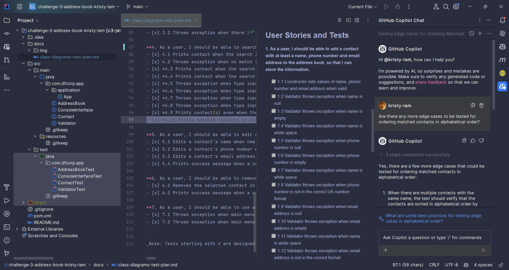
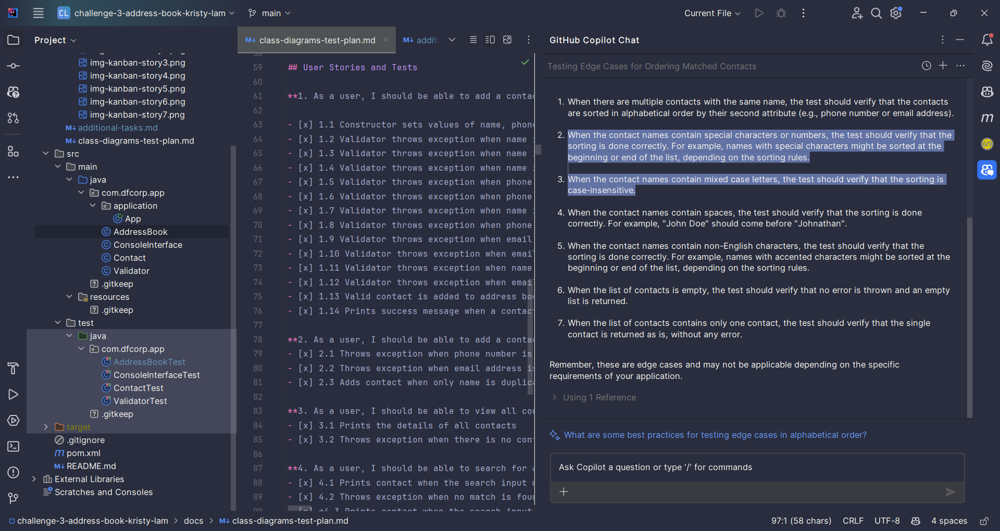

# Evidence of Using Copilot for Additional Tasks

For one of the additional features, I asked Copilot for some edge cases:
_**Sorting matched address book contacts in alphabetical order**_

I picked two of the answers given (as highlighted in the screenshot below) and did the tests.

Answer no. 2 - When the contact names contain special characters or numbers, the test should verify that the sorting is done correctly. For example, names with special characters might be sorted at the beginning or end of the list, depending on the sorting rules.  

Answer no. 3 - When the contact names contain mixed case letters, the test should verify that the sorting is case-insensitive.  

