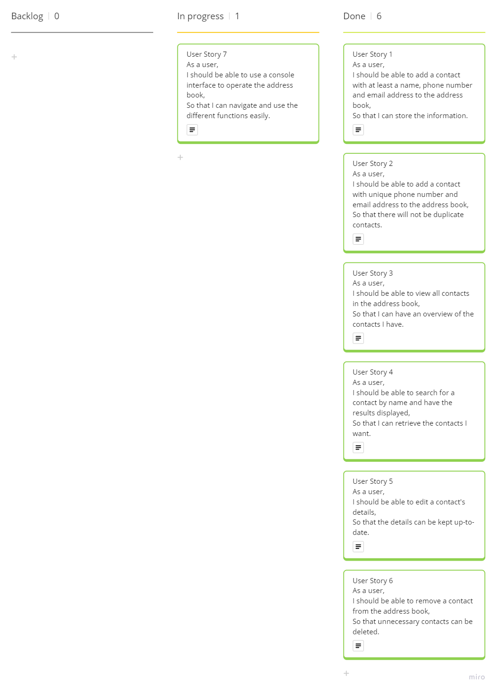
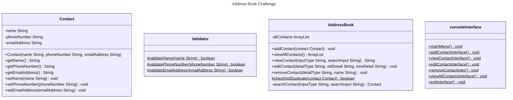

# Class Diagrams and Test Plan

In light of the client's requirements, six user stories have been identified. To accomplish the goals in the user stories, tests have been designed and conducted to ensure that the production code would deliver the desired outcomes. To adhere to the principle of single responsibility, the third party testing framework, Mockito, has been used in tests where two classes are involved so that tests remain independent, ensuring minimal coupling.

Please see below a UML class diagram which illustrates the properties and behaviours of the classes used. After that, the user stories listed in bullet points and the associated tests for the stories. A screenshot of the Kanban board tracking the development progress is attached below. Screenshots of the previous stages are stored in the "img" folder.

## UML Class Diagram

## User Stories and Tests

**1. As a user, I should be able to add a contact with at least a name, phone number and email address to the address book, so that I can store the information.**
   
- [x] 1.1 Constructor sets values of name, phone number and email address when valid
- [x] 1.2 Validator throws exception when name is null
- [x] 1.3 Validator throws exception when name is empty
- [x] 1.4 Validator throws exception when name is white space
- [x] 1.5 Validator throws exception when phone number is null
- [x] 1.6 Validator throws exception when phone number is empty
- [x] 1.7 Validator throws exception when name is white space
- [x] 1.8 Validator throws exception when phone number is not in the correct UK number format
- [x] 1.9 Validator throws exception when email address is null
- [x] 1.10 Validator throws exception when email address is empty
- [x] 1.11 Validator throws exception when name is white space
- [x] 1.12 Validator throws exception when email address is not in the correct format
- [x] 1.13 Valid contact is added to address book 
- [x] 1.14 Prints success message when a contact is created

**2. As a user, I should be able to add a contact with unique phone number and email address to the address book, so that there will not be duplicate contacts.**
- [x] 2.1 Throws exception when phone number is duplicating with another contact
- [x] 2.2 Throws exception when email address is duplicating with another contact
- [x] 2.3 Adds contact when only name is duplicating with another contact

**3. As a user, I should be able to view all contacts in the address book, so that I can have an overview of the contacts I have.**
- [x] 3.1 Prints the details of all contacts 
- [x] 3.2 Throws exception when there is no contact

**4. As a user, I should be able to search for a contact by name and have the results displayed, so that I can retrieve the contacts I want.**
- [x] 4.1 Prints contact when the search input matches the name of the contact
- [x] 4.2 Throws exception when search input is null
- [x] 4.3 Throws exception when search input is empty
- [x] 4.4 Throws exception when search input is white space
- [x] 4.5 Throws exception when search input does not match any name of contact

**5. As a user, I should be able to edit a contact's details, so that the details can be kept up-to-date.**
- [x] 5.1 Edits a contact's name when new name is valid
- [x] 5.2 Edits a contact's phone number when new phone number is valid
- [x] 5.3 Edits a contact's email address when new email address is valid
- [x] 5.4 Prints success message when a contact is edited

**6. As a user, I should be able to remove a contact from the address book, so that unnecessary contacts can be deleted.**
- [x] 6.1 Removes the selected contact in the address book
- [x] 6.2 Prints success message when a contact is removed

**7. As a user, I should be able to use a console interface to operate the address book, so that I can navigate and use the different functions easily.**
- [x] 7.1 Throws exception when main menu input is empty
- [x] 7.2 Throws exception when input is not a number between 0 and 5 
- [x] 7.3 Exits the app when input is 0
- [x] 7.4 Takes three inputs from user in add contact interface
- [x] 7.5 Takes three inputs from user in edit contact interface
- [ ] 7.6 Takes one input from user in remove contact interface
- [ ] 7.7 Takes one input from user in display contact interface
