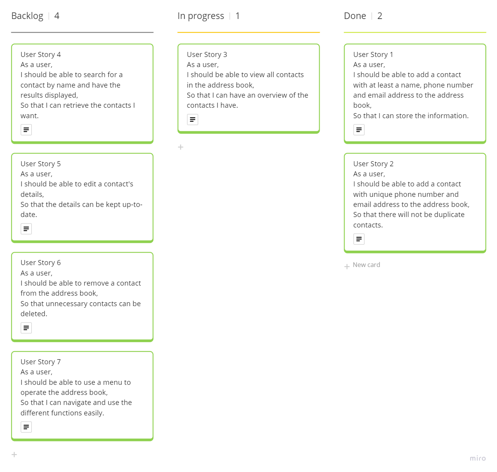
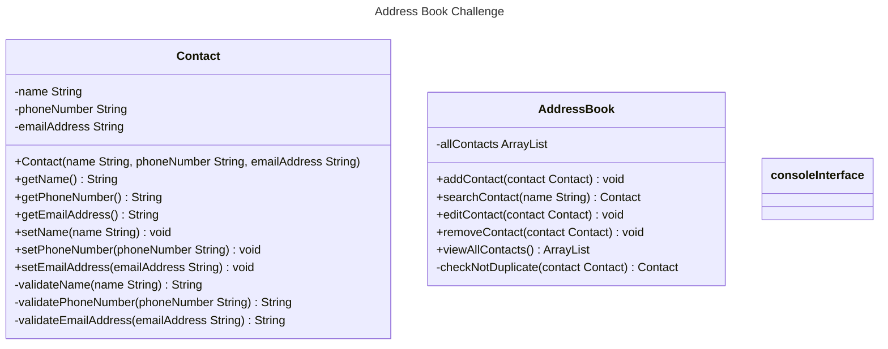

# Class Diagrams and Test Plan

In light of the client's requirements, six user stories have been identified. To accomplish the goals in the user stories, tests have been designed and conducted to ensure that the production code would deliver the desired outcomes. To adhere to the principle of single responsibility, the third party testing framework, Mockito, has been used in tests where two classes are involved so that tests remain independent, ensuring minimal coupling.

Please see below a UML class diagram which illustrates the properties and behaviours of the classes used. After that, the user stories listed in bullet points and the associated tests for the stories. A screenshot of the Kanban board tracking the development progress is attached below. Screenshots of the previous stages are stored in the "img" folder.

## UML Class Diagram

## User Stories and Tests

**1. As a user, I should be able to add a contact with at least a name, phone number and email address to the address book, so that I can store the information.**
   
- [x] 1.1 Constructor sets values of name, phone number and email address when valid
- [x] 1.2 Constructor throws exception when name is null
- [x] 1.3 Constructor throws exception when name is empty
- [x] 1.4 Constructor throws exception when name is white space
- [x] 1.5 Constructor throws exception when phone number is null
- [x] 1.6 Constructor throws exception when phone number is empty
- [x] 1.7 Constructor throws exception when name is white space
- [x] 1.8 Constructor throws exception when phone number is not in the correct UK number format
- [x] 1.9 Constructor throws exception when email address is null
- [x] 1.10 Constructor throws exception when email address is empty
- [x] 1.11 Constructor throws exception when name is white space
- [x] 1.12 Constructor throws exception when email address is not in the correct format
- [x] 1.13 Valid contact is added to address book 
- [x] 1.14 A success message is printed when a contact is created

**2. As a user, I should be able to add a contact with unique phone number and email address to the address book, so that there will not be duplicate contacts.**
- [x] 2.1 Throws exception when phone number is duplicating with another contact
- [x] 2.2 Throws exception when email address is duplicating with another contact
- [x] 2.3 Adds contact when only name is duplicating with another contact

**3. As a user, I should be able to view all contacts in the address book, so that I can have an overview of the contacts I have.**
- [ ] 3.1 Prints the details of all contacts 

**4. As a user, I should be able to search for a contact by name and have the results displayed, so that I can retrieve the contacts I want.**
- [ ]
- [ ] 
- [ ] 

**5. As a user, I should be able to edit a contact's details, so that the details can be kept up-to-date.**
- [ ]
- [ ] 
- [ ] 

**6. As a user, I should be able to remove a contact from the address book, so that unnecessary contacts can be deleted.**
- [ ]
- [ ] 
- [ ] 

**7. As a user, I should be able to use a menu to operate the address book, so that I can navigate and use the different functions easily.**
- [ ]
- [ ] 
- [ ] 